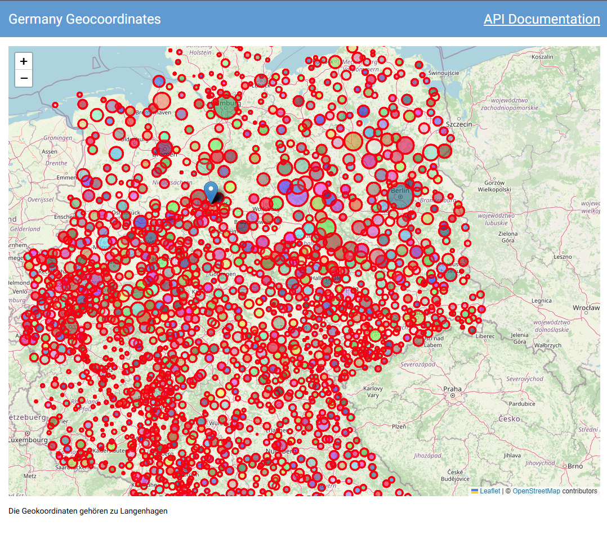
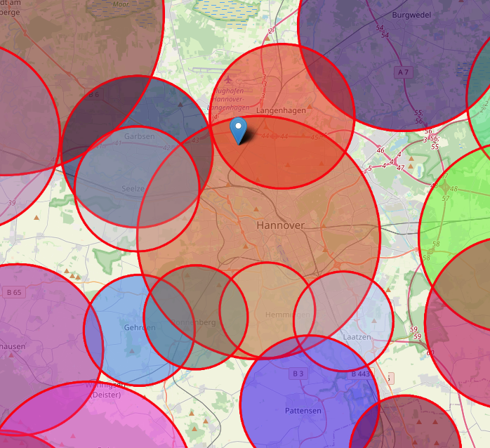
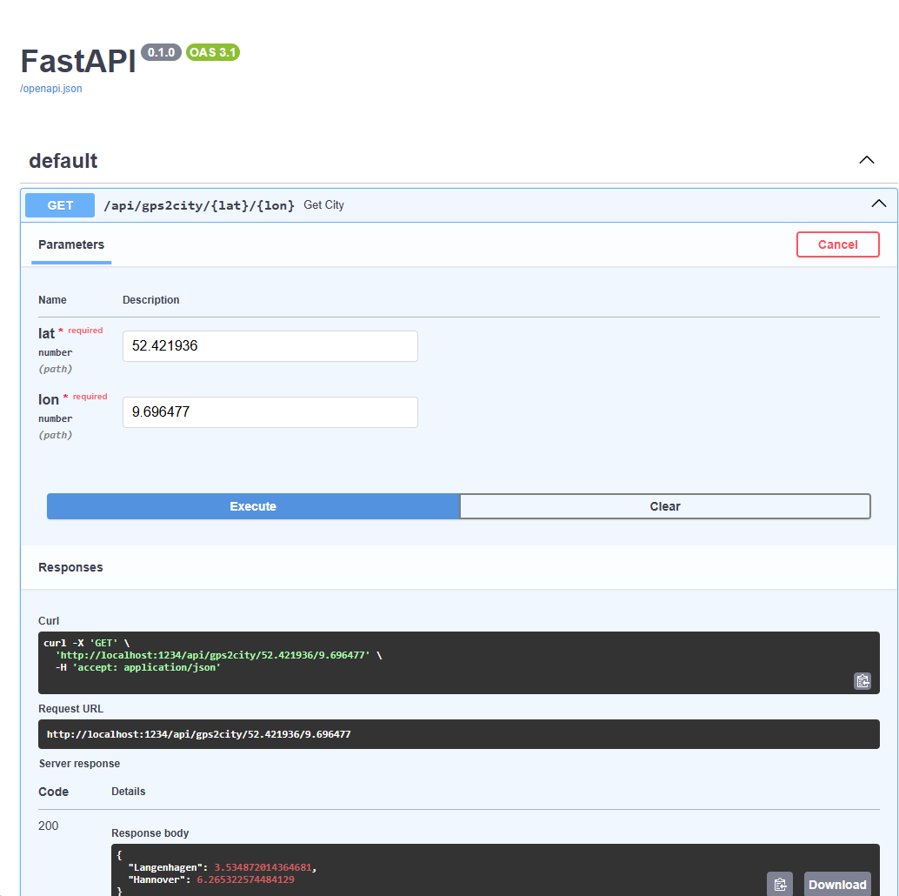

This is a little webservice build with [NiceGUI](https://nicegui.io) and [FastAPI](https://fastapi.tiangolo.com/).
It can translate gps coordinates (Latitude, Longitude) to the most commoon german cities.

See interactive demo [here](https://gps2city.boxathome.net/)




## Getting Started

These instructions will help you set up the project on your local machine for development and testing purposes.

### Prerequisites

Ensure you have the following installed:
- Python 3.10+
- NiceGUI (pip install nicegui)

### Installation and Running

1. Clone the repository:
    ```sh
    git clone https://github.com/khannover/gps2city.git
    cd gps2city
    python main.py
    ```

2. Open your browser and navigate to `http://localhost:1234`

## Usage

You can make GET requests to the webservice with the following parameters:

- URL: `http://localhost:1234/api/gps2city/{lat}/{lon}`
  - `lat` (float): Latitude
  - `lon` (float): Longitude

Example:

```sh
curl http://localhost:1234/api/gps2city/52.421936/9.696477
```

You should receive the following response:

```json
{
  "Langenhagen": 3.534872014364681,
  "Hannover": 6.265322574484129
}
```

Which means that the location with the coordinates `52.421936, 9.696477` is 3.53 km away from Langenhagen and 6.26 km away from Hannover.
As it is in range of both cities, both are listed in the response, with the closest city center at top.

- 
